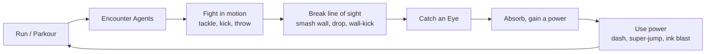
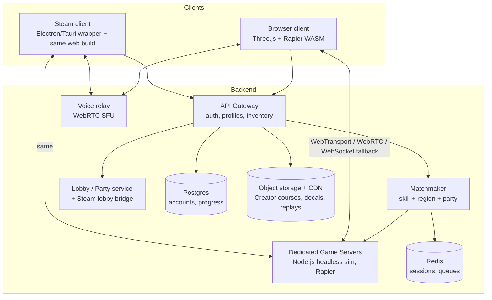
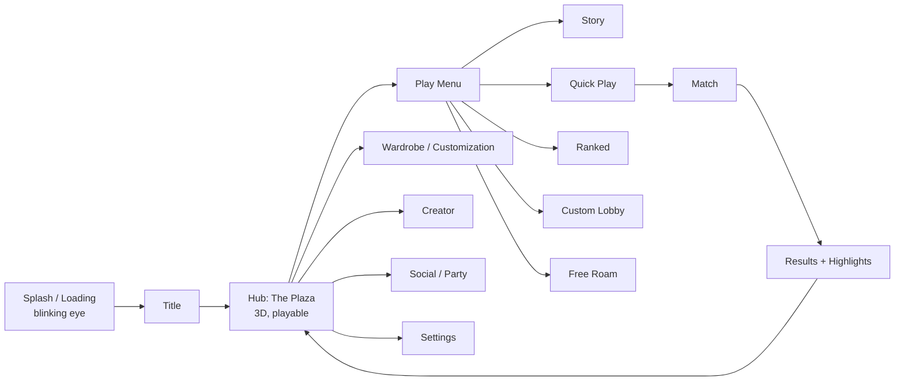
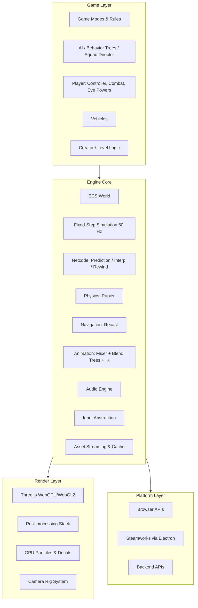
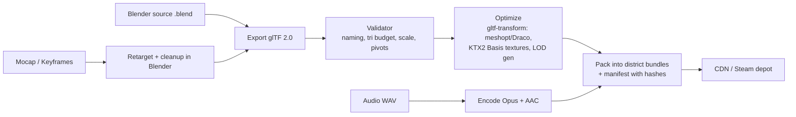

<div align="center">

# BLACKEYE: Ink City

### A stylized 3D parkour brawler for the browser and Steam. Run, fight and fly through a city that watches you back.

**Working title:** `BLACKEYE: Ink City` · **Repository codename:** `Black-fighter`
**Engine:** Three.js (WebGPU + WebGL2 fallback) · **Physics:** Rapier (WASM) · **Platforms:** Web browser, Steam (Windows / macOS / Linux / Steam Deck)
**Genre:** Third-/First-Person Parkour Action Brawler · **Modes:** Story, Co-op, PvP, Asymmetric Chase, Racing, Creator
**Status:** Pre-production. This document is the Game Design Document (GDD) and Technical Design Document (TDD).

</div>

---

## Table of Contents

1. [The Name](#1-the-name)
2. [Elevator Pitch](#2-elevator-pitch)
3. [Reference Video Analysis (Frame by Frame)](#3-reference-video-analysis-frame-by-frame)
4. [Design Pillars](#4-design-pillars)
5. [Game Overview](#5-game-overview)
6. [Core Gameplay Loops](#6-core-gameplay-loops)
7. [The Player Character](#7-the-player-character)
8. [Character Controller: Movement and Parkour](#8-character-controller-movement-and-parkour)
9. [Camera System: Third-Person, First-Person and Cinematic](#9-camera-system-third-person-first-person-and-cinematic)
10. [Combat System](#10-combat-system)
11. [The Eye Power System](#11-the-eye-power-system)
12. [Enemies and AI](#12-enemies-and-ai)
13. [World Design: Ink City](#13-world-design-ink-city)
14. [Level Design Metrics](#14-level-design-metrics)
15. [Game Modes](#15-game-modes)
16. [Customization (Everything Is Customizable)](#16-customization-everything-is-customizable)
17. [Multiplayer and Networking](#17-multiplayer-and-networking)
18. [Vehicle System and Car Controller (Later Phase)](#18-vehicle-system-and-car-controller-later-phase)
19. [Art Direction Bible](#19-art-direction-bible)
20. [Animation Bible](#20-animation-bible)
21. [VFX Bible](#21-vfx-bible)
22. [Audio and Music](#22-audio-and-music)
23. [UI / UX](#23-ui--ux)
24. [Controls and Input](#24-controls-and-input)
25. [Progression and Economy](#25-progression-and-economy)
26. [Story and Lore](#26-story-and-lore)
27. [Technical Architecture](#27-technical-architecture)
28. [Rendering Pipeline](#28-rendering-pipeline)
29. [Performance Budgets](#29-performance-budgets)
30. [Asset Pipeline](#30-asset-pipeline)
31. [Project Structure](#31-project-structure)
32. [Accessibility](#32-accessibility)
33. [Steam Publishing Plan](#33-steam-publishing-plan)
34. [Production Roadmap](#34-production-roadmap)
35. [Team and Roles](#35-team-and-roles)
36. [QA, Telemetry and Live Ops](#36-qa-telemetry-and-live-ops)
37. [Risks and Mitigations](#37-risks-and-mitigations)
38. [Legal and Original IP Notes](#38-legal-and-original-ip-notes)
39. [Glossary](#39-glossary)
40. [Definition of Done Checklists](#40-definition-of-done-checklists)

---

## 1. The Name

### Primary recommendation: **BLACKEYE: Ink City**

| Why it works | Detail |
|---|---|
| Triple meaning | A *black eye* is what you get in a fight (brawler). **Eyes** are the core motif of the world and the power system. **Black** ink is the visual signature and links to the repo name *Black-fighter*. |
| Short and searchable | Two syllables, easy to say on stream, easy to type into a Steam search. |
| Brandable | Works as a logo (an eye drawn in an ink splat), as a hashtag (`#BLACKEYEgame`) and as merch. |
| Subtitle gives room | "Ink City" is the first world. Expansions can become *BLACKEYE: Ink Rally* (vehicle update), *BLACKEYE: Void District*, and so on. |

### Alternatives (if the name is taken)

| Name | Vibe |
|---|---|
| **INKBOUND** | Clean, focused on the ink world |
| **OCULOPOLIS** | The city of eyes, more mysterious and art-house |
| **EYEBREAKER** | Aggressive, focused on the fight |
| **BLACK FIGHTER: Ink Runners** | Keeps the repo name as the brand |
| **SEEN** | Minimal, about being watched and hunted |

> **Before you commit:** search the Steam store, itch.io, the USPTO / WIPO / EUIPO trademark databases and domain registrars (`blackeyegame.com`, `.gg`, `.io`) for the final name. Reserve the Steam app name, the domain, and social handles (X, TikTok, YouTube, Discord, Twitch) on the same day.

---

## 2. Elevator Pitch

> **You are a Blank: a soft-faced streetwear kid in a monochrome city built from ink and concrete, where giant eyes on every wall watch your every move. Faceless Agents hunt you through rooftops, staircases and rope bridges. Run, wall-kick and smash through walls. Catch the burning Eyes that fall from the sky, push them into your chest to unlock wild powers, then launch into the sky with a shockwave super-jump. Play it alone, with friends in co-op, or against them as Runners vs Agents, in a browser tab or on Steam.**

**One-line hook:** *Mirror's Edge parkour meets a playful brawler, in a living street-art world, playable instantly in a browser.*

**Comparable titles (for pitch decks and Steam tags):** Mirror's Edge Catalyst (flow parkour), Sifu (stylized melee), Fall Guys / Stumble Guys (accessible multiplayer chaos), Rollerdrome (art direction plus action), Splatoon (ink identity), Ghostrunner (speed), Roblox-style avatar customization.

---

## 3. Reference Video Analysis (Frame by Frame)

The reference clip is **15.16 seconds** long, **1080×608 at 24 fps**, with stereo AAC audio. It was sampled at 2 frames per second (30 key frames) and checked for scene cuts.

**Key finding: the clip is almost one continuous take.** There are only **two hard cuts**: at **0.58 s** (an angle change right after the opening) and at **7.33 s** (from the power-absorb close-up back to gameplay). Everything else is one chase camera that flies with the character. **That one-take, camera-glued-to-the-hero feel is the most important thing to recreate.**

### 3.1 Timeline Breakdown

| Time (s) | What happens | Camera | Game system it implies |
|---|---|---|---|
| 0.0 | Hero jogs away from the camera into a white plaza covered in black ink puddles. Mushroom-shaped stone sculptures, floating low-poly clouds, a giant beanie-head statue far away. | Low third-person, behind, slightly below shoulder height | Third-person locomotion, hub-style open plaza |
| 0.5 | **Cut.** Tight low angle behind the hero; the back print of the jacket (an eye inside a planet ring) fills the frame. | Very low, close, wide FOV | Dynamic camera distance and FOV change while sprinting |
| 1.0 | **Melee clash.** A faceless Agent (white head, black suit) throws a flying kick; the hero dodges and lunges with a shoulder/headbutt. A second Agent attacks from the left. | Camera swings to the side and tilts (Dutch angle) | Melee combat, dodge, multi-enemy encounter |
| 1.5 | The hero bursts past two Agents and leaps. Teal crystal spikes stick out of the ground. | Wide, follows behind | Combat-to-traversal flow, environment hazards |
| 2.0 | The hero **smashes through a stone wall**. Big low-poly chunks explode outward. | Behind, chunks fly past the lens | **Destructible environment**, shoulder-charge move |
| 2.5 | Mid-air grapple with an Agent at a tower edge. Giant eyes are painted on the walls. | Side, high | Aerial grab/throw, ledge combat |
| 3.0 | Drops into a narrow gap between towers with arms out for balance. | Above and behind, looking down | Drop/fall state, balance animation |
| 3.5 | Falls past a wall with a huge purple eye. | Following, looking down | Long fall without damage (stylized) |
| 4.0 | **Wall-kick** off a tower toward a white bridge. | Side-on, close to the wall | Wall-run / wall-jump |
| 4.5 | A **flaming orange eye orb** spins toward the camera. | Orb passes right by the lens | Pickup / projectile that flies to the player |
| 5.0 | The hero floats mid-air in a starfish pose as the orb flies in. | Medium shot, slow-motion feel | **Time dilation** at a key moment |
| 5.5 – 6.0 | **Close-up:** the hero catches the burning eye in a white glove and stares at it with a deadpan, half-lidded face. | Extreme close-up, shallow depth of field | **Cinematic camera event**, facial expression system |
| 6.5 – 7.0 | The hero pushes the eye into their chest. Orange sparks burst out. **This is the power-up absorption.** | Close-up on the chest | **Power absorption ritual**, the core of the progression fantasy |
| 7.33 | **Cut** back to gameplay. | | |
| 7.5 | Lands on a white ledge and runs; an **orange speed streak** trails behind. | Behind, low | **Dash** ability unlocked by the eye |
| 8.0 | Agent on a plank staircase; the hero tackles. | Behind, close | Pursuit AI |
| 8.5 | Hit lands: the Agent **bursts into black ink**. | Very close, ink fills frame | Enemy defeat VFX (ink burst, not gore), hit-stop |
| 9.0 – 9.5 | More Agents run from behind a statue; the hero sprints and vaults a ledge. | Behind | Group chase AI, vault |
| 10.0 | Close tussle at a ledge; **teal paint splatters** on the ground. | Low, side | Ink-painting world (hits leave paint decals) |
| 10.5 | Runs down a black ramp covered in **purple goo**. | Behind | Surface types (goo = slippery or speed) |
| 11.0 – 12.0 | Runs down white stairs with Agents ahead and behind. | Behind and slightly above | Stair locomotion, chase pressure |
| 12.5 | **Shockwave super-jump.** A white smoke ring explodes around the hero. | Below, looking up through the ring | **Charged super-jump ability** |
| 13.0 | Flying up with radial speed-blur and debris streaks. | Behind, FOV punch | FOV kick, radial blur, speed lines |
| 13.5 – 14.0 | Arcs over a tower roof; rope bridges and floating planks below. | Behind and above | Air control, long-distance traversal |
| 14.5 – 15.0 | Lands on an ink-splattered rooftop; an Agent is already waiting. | Behind, wide | Landing impact, loop restarts (chase → fight) |

### 3.2 What the Clip Tells Us About the Game

1. **The loop is Chase → Fight → Traverse → Power-up → Escalate.** In 15 seconds the hero fights, flees, smashes, climbs, catches a power, uses it, and lands into a new fight.
2. **Movement and combat are the same verb.** Tackles happen mid-run. Wall-kicks lead into attacks. There is no "combat mode."
3. **Verticality is everything.** The city is stacked towers, stairs, bridges and drops. The camera spends half its time looking up or down.
4. **The Eye is the central symbol.** Eyes are painted on walls, built into towers, shown as the power-up, and printed on the jacket. *The city is watching.*
5. **Ink is the feedback language.** Defeated enemies burst into ink. Hits leave paint. Walls drip. The ground has ink puddles.
6. **The tone is deadpan-cool, not grimdark.** The hero's face stays calm and bored even while catching a fireball. Funny and stylish.
7. **Cinematic moments are built into gameplay.** Slow-motion on the catch, a close-up on the absorb, a shockwave on the jump. These need to be **systemic** (triggered by gameplay), not pre-rendered cutscenes.

### 3.3 Visual Language Extracted

| Element | Observed | Our rule |
|---|---|---|
| Geometry | Faceted low-poly with visible flat triangles on the head, rocks, clouds and statues; blocky brutalist towers | **"Faceted Toy" style:** flat-shaded or lightly smoothed facets, chunky silhouettes, no fine detail |
| Base palette | Mostly greyscale: chalk white to charcoal black | 85% of every frame is greyscale |
| Accents | Electric purple (goo, glows), teal (paint, glass, panels), fire orange (eyes, sparks, dash) | Accents mean something: **purple = danger/void**, **teal = safe/route/interactive**, **orange = power/eye energy** |
| Surface detail | Black ink drips down walls, cow-pattern ink blots on floors, splatter decals | Decal-driven detail, not texture-heavy |
| Props | Mushroom statues, giant head busts, floating clouds, floating rocks, billboards, black-and-white hazard-striped beams, rope bridges, cables between towers | A modular kit (see §13.4) |
| Lighting | Overcast soft sky, strong ambient occlusion, small emissive accents (lamps, eyes, sparks) | Soft hemisphere light, SSAO/GTAO, emissive bloom |
| Post | Depth of field, motion blur, bloom on emissives, slight film grain, cool desaturated grade | A stack of post-processing passes with a colour lookup table (see §28) |
| Characters | Big round white heads with drawn-on cartoon faces; white mitten gloves; chunky white sneakers; black streetwear | Original character kit (see §7) |

### 3.4 Palette (Starting Point)

| Token | Hex | Use |
|---|---|---|
| `chalk` | `#ECEAE6` | Ground, heads, statues, clouds |
| `concrete` | `#B9B7B4` | Mid-tone walls |
| `graphite` | `#4A4A50` | Shadowed blocks |
| `ink` | `#141418` | Towers, clothes, drips, enemies |
| `void-purple` | `#6B2BFF` | Goo, danger, void power |
| `route-teal` | `#17A9A3` | Paint, glass, interactive and route hints |
| `eye-fire` | `#FF7A1A` | Eye orbs, dash trail, sparks |
| `eye-core` | `#FFD27A` | Bloom core of fire effects |

---

## 4. Design Pillars

Every feature must support at least two pillars. If it doesn't, cut it.

| # | Pillar | Meaning | Test question |
|---|---|---|---|
| 1 | **Flow Is King** | Movement never stops dead. Every action can chain into the next. | "Can I keep my momentum through this?" |
| 2 | **One-Take Cinema** | The camera makes every run look like a trailer, and big moments happen systemically. | "Would this look good in a clip someone posts?" |
| 3 | **The City Watches** | The world reacts: eyes track you, ink remembers your path, Agents coordinate. | "Does the world notice what I did?" |
| 4 | **Deadpan Style** | Cool, funny, never edgy for its own sake. Expression over realism. | "Is this stylish and a little absurd?" |
| 5 | **Instant to Play, Deep to Master** | Click a link and play in 10 seconds. Skill ceiling goes high. | "Can a new player do it, and can a pro do it better?" |
| 6 | **Yours to Shape** | Character, controls, rules and levels are all customizable. | "Can the player make this their own?" |

---

## 5. Game Overview

| Field | Value |
|---|---|
| Genre | 3D parkour action brawler with multiplayer |
| Perspective | Third-person (default), First-person (full-body, toggle any time), Cinematic (systemic events) |
| Players | 1 (story), 1–4 (co-op), 2–16 (PvP / Chase), up to 32 (Free Roam social hub) |
| Session length | 3–8 min multiplayer matches; 20–40 min story chapters |
| Target audience | 13+ players of action, parkour and party games; streamers and clip creators; Roblox/Fortnite graduates looking for style |
| Rating target | PEGI 12 / ESRB T (cartoon violence, no blood: enemies burst into ink) |
| Platforms | Browser (Chrome, Edge, Firefox, Safari 17+), Steam (Win/Mac/Linux), Steam Deck Verified target |
| Input | Keyboard and mouse, gamepad (Xbox/PS/Switch Pro/Steam Deck), touch (browser mobile, a later and simplified version) |
| Business model | Premium on Steam (US$14.99–19.99) **plus** a free browser demo / free web "Free Roam + 1 mode" funnel. Cosmetic-only DLC/Season Pass. **No pay-to-win.** |

### Unique Selling Points

1. **Play instantly in a browser, then continue on Steam** with the same account, progress and friends (cross-play and cross-progression).
2. **Flow parkour plus brawling in one moveset.** No mode switching.
3. **Eye Powers:** catch-and-absorb power-ups that change how you move and fight.
4. **Full-body first-person and third-person** with a seamless toggle. You can see your own arms, legs and gloves in first person.
5. **Runners vs Agents**, an asymmetric chase mode built for streaming.
6. **Creator Mode** with a modular block kit for user-made courses, shared through Steam Workshop and web links.
7. **Vehicles (post-launch update):** ink-powered cars with a full car controller, in races and in the open world.

---

## 6. Core Gameplay Loops

### 6.1 Moment-to-Moment (0–30 seconds)



### 6.2 Session Loop (3–40 minutes)

Pick a mode → Load into district → Complete objectives (escape, deliver, race, survive, tag) → Earn **Ink** (soft currency) and **XP** → Results screen with highlight replay → Back to hub.

### 6.3 Meta Loop (days and weeks)

Level up → Unlock cosmetics, emotes and Eye Power variants → Climb ranked → Weekly challenges → Seasonal district and story chapter → Make and share Creator courses.

### 6.4 The "Flow Meter"

A hidden-then-visible combo system that rewards chaining:

- Each move without stopping, taking damage or repeating adds **Flow**.
- Flow tiers: **Cold → Warm → Hot → Inked → BLACKEYE**.
- Higher tiers mean more speed (up to +15%), faster Eye charge, music layers adding in, a stronger camera FOV kick, and longer ink trails.
- Flow decays after 1.5 s idle, or instantly when you are hit.

---

## 7. The Player Character

### 7.1 The "Blank" (Default Hero)

An **original** character inspired by the *feel* of the reference, not a copy of it (see §38).

| Part | Description |
|---|---|
| Head | Oversized round head (~1.4× realistic proportion), faceted low-poly, chalk-white. Face is **not modelled**: it is a **drawn-on decal** that swaps per expression (see §7.3). |
| Hat | Slouchy knit beanie (default), swappable. |
| Body | Slightly chibi proportions: head ~28% of height, short torso, long-ish legs for readable running. |
| Hands | White four-finger mitten gloves, oversized for readable gestures and catches. |
| Outfit | Black oversized jacket with patches, coloured T-shirt, chain, cargo pants. **All swappable.** |
| Shoes | Chunky white sneakers with big soles, for readable foot placement. |
| Height | 1.65 m in world units (capsule 1.6 m, radius 0.35 m). |

### 7.2 Skeleton and Rig

- **Humanoid skeleton** compatible with standard retargeting (Mixamo-style naming, or a custom naming map that the retargeter understands).
- 65 bones for body; plus **face is decal-driven**, so no face bones are needed (cheap and stylish).
- Extra bones: `hat_jiggle`, `jacket_L/R` (2 spring chains), `chain_01–03`, `prop_R`, `prop_L`, `camera_FP` (first-person anchor at eye level).
- **IK targets:** feet (ground alignment on stairs and slopes), hands (ledge grabs, wall touches, catching), look-at (head tracks targets and Eyes).
- **Secondary motion:** spring bones on jacket, beanie tip, chain. Simulated cheaply on the CPU or GPU; turned off on low settings.

### 7.3 Expression System (Decal Faces)

The face is a texture atlas of hand-drawn expressions projected on the head. This matches the deadpan cartoon look and costs nearly nothing.

| Expression | Trigger |
|---|---|
| Deadpan (default) | Idle, running |
| Half-lid bored | Idle long, catching an Eye (signature look) |
| Focus | Combat stance, aiming |
| Wince | Hit taken |
| Wide-eye | Big fall, near miss |
| Smirk | Combo finisher, win |
| X-eyes | Knocked out |
| Blink | Random, every 2–6 s |

Players can pick a **face style pack** (line thickness, eye shape, mouth styles) in customization and design custom faces in the Face Editor.

### 7.4 Stats

| Stat | Base | Notes |
|---|---|---|
| Health | 100 | Regenerates after 4 s out of combat (story), off in competitive |
| Stamina | 100 | Used by sprint (slow drain), dodge (20), wall-run (drain), heavy attacks (15) |
| Eye Energy | 0–100 | Filled by absorbing Eyes and by Flow; spent on Eye Powers |
| Weight class | Medium | Affects knockback (customization never changes stats in PvP) |

---

## 8. Character Controller: Movement and Parkour

The controller is the heart of the game. It must feel great **before** anything else is built.

### 8.1 Architecture

- **Kinematic character controller** (Rapier `KinematicCharacterController`) with a capsule collider. We do not use a fully dynamic rigid body, because it gives precise, game-feel-driven movement.
- **Hierarchical state machine:** `Grounded`, `Airborne`, `WallRun`, `Ledge`, `Climb`, `Slide`, `Vault`, `Combat`, `Ragdoll`, `Vehicle`, `Cinematic`.
- **Fixed-timestep simulation at 60 Hz** (decoupled from render rate), with interpolation for rendering. This is required for deterministic-enough networking (see §17).
- **Environment queries** each tick: ground probe, forward ledge scan (3 rays at knee, chest and head height), wall side probes (left and right), ceiling probe, and step detection.
- **Motion warping:** vault, mantle and ledge animations are warped so hands land exactly on the edge.

### 8.2 Movement Tuning (starting values, all exposed in a debug panel)

| Parameter | Value | Notes |
|---|---|---|
| Walk speed | 2.2 m/s | Analog stick partial tilt |
| Run speed | 6.0 m/s | Default movement |
| Sprint speed | 8.5 m/s | Hold sprint, drains stamina slowly |
| Acceleration (ground) | 40 m/s² | Snappy |
| Deceleration (ground) | 30 m/s² | Short skid animation when stopping from sprint |
| Turn rate | 720°/s | With lean animation |
| Air control | 35% of ground | |
| Gravity (rising) | −24 m/s² | |
| Gravity (falling) | −38 m/s² | Snappier falls |
| Terminal velocity | −40 m/s | |
| Jump apex height | 1.6 m | |
| Variable jump | Release early = 55% height | |
| Coyote time | 120 ms | Jump after leaving a ledge |
| Jump buffer | 150 ms | Press jump before landing |
| Step height | 0.45 m | Stairs feel smooth |
| Max slope | 50° | Beyond this = slide |
| Fall damage | None in Story/Free Roam; a stagger "hard landing" over 12 m unless you roll | Stylized, forgiving |

### 8.3 Parkour Moveset

| Move | Input | Condition | Result |
|---|---|---|---|
| **Vault** | Run into an obstacle 0.5–1.2 m high | Speed > 3 m/s | Keeps 100% speed |
| **Mantle** | Jump at a ledge 1.2–2.4 m | Ledge detected | Pulls up; keeps 60% speed |
| **Ledge Grab / Hang** | Auto when falling past a ledge, or hold Grab | | Shimmy left/right, jump up, back-eject |
| **Wall Run** | Jump at a wall at an angle of 15–75° | Speed > 5 m/s | Up to 1.2 s, slight arc; can chain wall-to-wall |
| **Wall Climb (vertical)** | Jump straight at a wall | | Up to 2.5 m extra height, then mantle or kick |
| **Wall Kick** | Jump during wall run or climb | | Launches away at 50° plus input direction; seen at 4.0 s in the reference |
| **Slide** | Crouch while running | Speed > 5 m/s | 0.8 s, under obstacles; can slide-kick |
| **Roll** | Crouch at landing within 200 ms | Fall > 4 m | Removes landing stagger, keeps speed |
| **Dodge / Side-step** | Dodge button + direction | 20 stamina | 0.25 s, i-frames 0.15 s |
| **Zipline / Cable slide** | Jump to a cable | | Fast travel along the tower cables visible in the reference |
| **Rope Bridge** | Auto | | Sway physics; running on it makes it bounce |
| **Pole Swing** | Jump to a horizontal bar | | Swing release boost |
| **Wall Smash** | Sprint plus heavy attack into a cracked wall | Destructible wall | Bursts through (reference 2.0 s) |
| **Ledge Drop** | Crouch at an edge | | Drops into a hang |
| **Stair Slide** | Slide on stairs | | Speed boost downhill |
| **Goo Surf** | Slide on purple goo | | Low friction, +30% speed, harder steering |

### 8.4 Surface Types

| Surface | Friction | Sound | Special |
|---|---|---|---|
| Concrete (white) | 1.0 | Soft tap | – |
| Ink floor (black) | 0.95 | Wet tap | Leaves footprints |
| Purple goo | 0.15 | Squelch | Speed surf; enemies slip |
| Teal paint | 1.0 | Tap | Marks the "safe route"; Eye charge +5% |
| Wood planks | 1.0 | Hollow | Can break under heavy landing |
| Rope bridge | 0.9 | Creak | Sways |
| Glass | 0.8 | Clink | Shatters when smashed |

### 8.5 Game-Feel Checklist

- Hit-stop on every melee impact (40–90 ms).
- Camera shake scaled by impact (Perlin, not random jitter).
- Landing squash (head and body scale 0.9 for 80 ms).
- Dust and ink puffs on landing, wall-kick and sharp turns.
- FOV kick on sprint (+6°), dash (+12°) and super-jump (+18°).
- Controller rumble profiles per event (on Steam via Steam Input; in browser via the Gamepad Haptics API where supported).
- Audio pitch slightly randomized on footsteps.
- Anticipation frames on jumps kept to 2 frames max (responsiveness over realism).

---

## 9. Camera System: Third-Person, First-Person and Cinematic

### 9.1 Third-Person Camera (Default)

- **Spring-arm camera** with collision (sphere cast from pivot to camera; pulls in on hit; eases back out over 0.3 s).
- **Pivot** at upper chest/neck, offset 0.35 m right (shoulder cam), swappable left/right.
- **Distance:** 3.2 m jogging, 3.8 m sprinting, 2.4 m in combat, 5–6 m in the air or on a super-jump.
- **Low-angle bias:** the camera sits slightly **below** head height when running on flat ground (the reference look). Pitch default −5°.
- **Auto-framing:** looks ahead along velocity; leads the camera into the run direction when there is no mouse/stick input for 1 s.
- **Combat framing:** soft lock frames hero plus target, keeps both on screen and adds Dutch tilt (up to 6°) on heavy hits.
- **Look-down assist:** while falling or dropping, the camera pitches down to show the landing zone (reference 3.0–3.5 s).
- **Wall-run framing:** the camera swings out away from the wall and rolls 5° (reference 4.0 s).
- **Occlusion:** objects between camera and hero dither-fade (screen-door transparency) instead of popping.

### 9.2 First-Person Camera (Full-Body Awareness)

- The **same character model** is used. The camera is attached to the `camera_FP` bone at eye level, so you see your **own gloves, arms, legs and shoes**.
- The head mesh and hat are hidden from the first-person camera using a render layer, but they still cast shadows.
- **Head bob** comes from the real animation with a stabilization filter (adjustable 0–100%, default 40%) to avoid motion sickness.
- **Separate FOV** setting (default 90°), plus a weapon/hand FOV so the gloves don't distort.
- Parkour in first person shows hands reaching for ledges, gloves pressing walls, and legs during slides.
- The Eye catch in first person: the glove reaches into view, the eye fills the screen, then it is pushed into the chest. This is a great first-person moment.
- **Toggle:** a single key (`V`) or a d-pad press. The transition is a 0.25 s blend that pushes the camera into the head.

### 9.3 Cinematic / Systemic Camera Events

Short (0.5–2 s) camera moments triggered by gameplay, never taking control away for long:

| Event | Camera behaviour | Time scale |
|---|---|---|
| Eye Catch | Orbit to the front of the hero, close-up, shallow DOF (reference 5.5–7.0 s) | 0.25× for 0.6 s |
| Eye Absorb | Push in on the chest, spark burst, back out | 0.4× for 0.5 s |
| Final hit on last enemy | Side angle slow-mo, ink burst | 0.2× for 0.4 s |
| Super-jump launch | Low angle looking up through the shockwave ring (reference 12.5 s) | 0.5× for 0.25 s |
| Wall smash | Camera follows through the hole with debris passing the lens | 1.0× |
| Near-miss | Slight zoom and chromatic pulse | 0.7× for 0.2 s |

- All events can be **reduced or disabled** in settings (accessibility and competitive).
- **In multiplayer, time dilation is local camera-only.** The simulation never slows down; the camera and animation play the moment with a "fake slow-mo" effect (motion blur, hold frame, speed ramp on VFX).

### 9.4 Other Camera Modes

- **Photo Mode:** free camera, pause, filters, poses, expression picker, depth of field, frame overlays. Steam screenshot integration.
- **Spectator / Replay Camera:** free-fly, follow player, auto-director (cuts to the most action-dense player).
- **Kill Cam / Highlight Reel:** end-of-match auto-highlights using the replay system (see §17.8).
- **Vehicle cameras** (see §18).

---

## 10. Combat System

### 10.1 Philosophy

**"Fight while moving."** Combat is a layer on top of traversal, not a separate mode. Every attack has a version for running, airborne, wall and slide states.

### 10.2 Moveset

| Input | Grounded | Running | Airborne | Wall | Slide |
|---|---|---|---|---|---|
| Light attack | 4-hit combo (jab, jab, hook, kick) | Running shoulder bump | Air kick (chains 3) | Wall-kick strike | Slide sweep (trip) |
| Heavy attack | Charged punch (hold) | **Tackle** (reference 8.0 s) | Dive stomp | Wall-launch dropkick | Slide uppercut |
| Grab | Grab → throw (4 directions) | Running grab → slam | **Aerial grab** (reference 2.5 s) | – | – |
| Dodge | Side-step / backstep | Barrel roll | Air dodge (1 per jump) | – | – |
| Parry | Timed block (120 ms window) → counter | – | – | – | – |
| Eye Power | See §11 | | | | |

### 10.3 Combat Rules

- **Hitboxes** come from animation-authored shapes (spheres and capsules on bones, active on specified frames). **Hurtboxes** are on the skeleton.
- **Hit-stop:** light 40 ms, heavy 70 ms, finisher 120 ms.
- **Knockback** uses a launch vector plus a weight class. Wall-splats happen when knocked into walls.
- **Environmental kills (KOs):** knock Agents off ledges, into goo, or through destructible walls.
- **Juggling:** up to 3 air hits, then a forced knock-down (prevents infinite combos).
- **Poise:** Agents have poise; light hits don't interrupt heavy enemies until poise breaks.
- **Defeat VFX:** enemies **burst into ink** with a paint decal left on the floor and walls (reference 8.5 s). No blood, ever.

### 10.4 Lock-On

- **Soft lock** by default: attacks magnetize toward the nearest enemy within a 3.5 m cone.
- **Hard lock** (optional, middle mouse or R3) for focused fights; switch targets with the stick flick or mouse wheel.

### 10.5 PvP Balance Rules

- Same moveset for everyone. Cosmetics never change hitboxes. Hitboxes are standardized per **body template**, not per outfit.
- Eye Powers in PvP come from map pickups only (no pre-equipped advantage), or from a mode-defined loadout.

---

## 11. The Eye Power System

The burning eye orb in the reference is the progression fantasy: **catch it, absorb it, become stronger.**

### 11.1 How It Works

1. **Eyes spawn** at Eye Nests on the map, drop from defeated Elite Agents, or **fly toward you** when your Flow tier is high (reference 4.5–5.0 s).
2. **Catch:** touch it, or press Grab when in range (2 m). A mid-air catch triggers the cinematic camera.
3. **Absorb:** automatic over 0.6 s (can be cancelled by movement in competitive mode). Fills **Eye Energy** and grants a **Power Charge** for that Eye type.
4. **Use:** the Power button triggers the active Eye; cycle with the d-pad or number keys 1–4.

### 11.2 Eye Types

| Eye | Colour | Power | Charges | Seen in reference |
|---|---|---|---|---|
| **Fire Eye** | Orange | **Dash Burst:** an 18 m/s 0.35 s dash with a fire trail that damages enemies | 3 | Yes, 7.5 s |
| **Sky Eye** | White | **Shockwave Super-Jump:** hold to charge, up to 12 m high; the shockwave ring knocks back nearby enemies | 2 | Yes, 12.5 s |
| **Void Eye** | Purple | **Ink Blink:** short-range teleport (8 m) through enemies or thin walls | 2 | Purple glows and goo |
| **Tide Eye** | Teal | **Paint Path:** for 6 s you leave a teal trail that speeds up allies and slows Agents | 1 | Teal paint |
| **Iron Eye** | Grey | **Wrecking Shoulder:** an unstoppable charge that breaks any destructible | 2 | Wall smash, 2.0 s |
| **Watcher Eye** | Gold (rare) | **Reveal:** all enemies and pickups highlighted through walls for 8 s | 1 | Wall eyes |
| **BLACKEYE** | Black with orange rim (ultimate) | **Ink Storm:** 6 s of max Flow, all powers at half cost, ink-burst on every hit | 1 | Title power |

### 11.3 Eye Mastery (Progression)

Each Eye has a **mastery track** (levels 1–10) earned by using it. Mastery unlocks:

- **Variants** (sidegrades, not upgrades in PvP). For example, Fire Dash: *Long* (longer dash, less damage) or *Chain* (two short dashes).
- **Cosmetic changes:** trail colours, absorb animations, sound flavours.
- In **Story / PvE**, mastery also gives small upgrades (e.g. +1 charge).

---

## 12. Enemies and AI

### 12.1 Enemy Roster

| Enemy | Look | Behaviour | Threat |
|---|---|---|---|
| **Agent** (basic) | Faceless white head, black suit (reference) | Chases, flanks, basic punches and flying kicks | Low |
| **Runner Agent** | Thinner, track-suit | Very fast, mirrors your parkour (wall-runs, vaults) | Medium |
| **Brute** | Huge, statue-like head | Slow; grabs and slams; can only be staggered by heavy attacks or Iron Eye | High |
| **Spotter** | Floating camera-eye drone | Doesn't attack; spots you and calls Agents, raises the **Alert level** | Support |
| **Painter** | Agent with a roller | Paints purple goo traps and ink walls to cut off routes | Control |
| **Sniper Eye** | Wall-mounted giant eye | Fires a slow beam; you can break line of sight | Area denial |
| **Elite (Watcher)** | Agent with a glowing eye mask | Uses Eye Powers against you; drops Eyes | High |
| **Bosses** | Giant statues come to life (the huge figures in the background of the reference) | Multi-phase, arena traversal fights | Boss |

### 12.2 AI Architecture

- **Behaviour Trees** for decision-making plus a **utility scorer** for choosing the target and tactic.
- **Squad Director:** a central "Agent Command" coordinates up to 12 active Agents. It assigns roles (chaser, flanker, cutter-off, ambusher) so they surround the player instead of all running in a line.
- **Navigation:** navmesh (`recast-navigation` WASM build) with **off-mesh links** for jumps, vaults, ladders, ziplines and wall-runs, so Runner Agents can parkour too.
- **Crowd avoidance:** RVO/ORCA local avoidance.
- **Perception:** sight cones, hearing (footsteps, smashes), and the **City Eyes** network: painted wall eyes are cameras that report your position when the Alert level is high.
- **Alert Levels:** Calm → Suspicious → Hunted → **Manhunt** (more Agents, Spotters and Elites; music escalates).
- **Attack tokens:** only 2–3 Agents may attack at once (the classic brawler fairness rule); the rest circle and taunt.
- **LOD AI:** far Agents update at 5 Hz, near at 30 Hz, on-screen fighting at 60 Hz.

### 12.3 Difficulty

| Setting | Agent damage | Attack tokens | Parry window | Aim assist |
|---|---|---|---|---|
| Chill | 50% | 1 | 200 ms | High |
| Normal | 100% | 2 | 120 ms | Medium |
| Hard | 140% | 3 | 90 ms | Low |
| BLACKEYE | 200% | 4 | 70 ms | Off, plus permadeath runs |

Fine-grained sliders (game speed, enemy aggression, damage taken) are available in Accessibility (see §32).

---

## 13. World Design: Ink City

### 13.1 Setting

**Oculopolis**, nicknamed **Ink City**: a vertical city of stacked concrete and black-ink towers floating above a cloud sea. The city was painted into existence by **The Watchers**, and every eye on every wall is one of their eyes. Blanks are the city's unfinished residents: characters without faces who drew their own. The Agents keep everyone "on model."

### 13.2 Districts (Launch: 4, plus seasonal additions)

| District | Theme | Traversal focus | Signature feature |
|---|---|---|---|
| **The Plaza** (hub) | White plaza with mushroom statues and ink puddles (reference 0.0 s) | Tutorial, social | Shops, customization, matchmaking portals |
| **Stacks** | Dense black towers, stairs, rope bridges (reference 3.0–4.0 s, 13.5 s) | Vertical climbing, wall-runs | Cable network for ziplines |
| **Goo Works** | Purple goo factories and ramps (reference 10.5 s) | Sliding, surfing | Goo rivers and pumps |
| **Gallery** | Giant statues, busts and billboards | Big jumps, statue climbing | Statue boss arena |
| **Drip Heights** (season 1) | Inverted towers dripping ink | Upside-down sections | Gravity flips |
| **Void District** (season 2) | Purple void and broken geometry | Teleport puzzles | Void Eye focus |

### 13.3 World Structure

- **Story:** semi-open hub-and-district structure. Each district is a ~400 m × 400 m × 200 m (tall) playable volume, streamed in chunks.
- **Multiplayer maps:** hand-crafted arenas and courses carved out of districts.
- **Free Roam:** the whole city linked by cables, bridges and (post-launch) roads for vehicles.

### 13.4 Modular Kit (Built in Blender, Assembled in the Level Editor)

| Category | Pieces |
|---|---|
| Blocks | 1×1, 2×1, 2×2, 4×4 m cubes; tower segments (4 m, 8 m); slabs; ramps (15°, 30°, 45°) |
| Stairs | Straight, L-turn, spiral, broken |
| Bridges | Rope bridge (physics), plank bridge, steel beam with hazard stripes |
| Props | Mushroom statues, head busts, billboards (with animated video textures), lamp posts, crates, pipes, cables, antennas |
| Eyes | Wall eye decals (static, tracking, Sniper), eye windows, eye billboards |
| Nature | Floating low-poly clouds, floating rocks, cloud sea |
| Hazards | Goo pools, teal crystal spikes (reference 1.5 s), breakable planks, falling blocks |
| Destructibles | Cracked walls, glass panels, wooden planks, statues (boss) |
| Decals | Ink drips, splats, cow-pattern blots, teal paint, purple goo, graffiti, route arrows |

### 13.5 Destruction

- **Pre-fractured meshes** (Voronoi fracture in Blender) swapped in at the moment of impact. Chunks become dynamic rigid bodies for 3–5 s, then fade and sleep.
- Chunk count budget: 40 active chunks per smash, 200 globally.
- In multiplayer, the **fact** of destruction is server-authoritative (which wall broke and when). The **chunk physics** is client-side cosmetic, so it doesn't need to be synced.
- Destroyed walls **rebuild** over 60 s in multiplayer (paint-in effect) so routes stay balanced.

### 13.6 Ink Persistence ("The City Remembers")

- Hits, defeats and goo-surfing leave **paint decals** stored in a per-district **ink map** (a low-res render-target texture projected from the top plus decals on walls).
- In multiplayer modes, teams can "claim" areas by painting them (Ink Turf mode, see §15).

---

## 14. Level Design Metrics

Strict metrics let level designers build routes that always work with the controller. **These numbers are a contract between the controller programmer and the level designers.** If the controller changes, the metrics doc changes the same day.

| Metric | Value |
|---|---|
| Grid unit | 0.5 m (snap), 4 m (block) |
| Player height / width | 1.65 m / 0.7 m |
| Door / passage min | 1.2 m wide × 2.2 m high |
| Slide gap height | 0.9 m |
| Vault height | 0.5 – 1.2 m |
| Mantle height | 1.2 – 2.4 m |
| Wall climb max (plus mantle) | 4.8 m |
| Standing jump gap | 2.5 m |
| Running jump gap | 4.0 m |
| Sprint jump gap | 5.5 m |
| Wall-run horizontal distance | 7–8 m |
| Wall-to-wall chain gap | 3–5 m |
| Fire Dash distance | 6.3 m |
| Super-jump height | 12 m (max charge) |
| Safe drop | 12 m (no stagger) |
| Combat arena min size | 12 m × 12 m |
| Stair step | 0.25 m rise, 0.35 m run |
| Route readability | Teal paint marks the "golden path"; every critical ledge has a white top edge against a dark wall |

Every district includes a **gym level**: a test map with every metric laid out. It is used for automated controller regression tests (see §36).

---

## 15. Game Modes

### 15.1 Story Mode, "Drawn Out" (1 player or 2–4 co-op)

- 4 launch chapters (one per district), 6–8 missions each. 8–12 hours for the main path.
- Mission types: Escape (reference-style chase), Delivery (carry a Watcher Eye across the city), Takedown (defeat an Elite), Infiltration (avoid Spotters), Boss.
- Drop-in/drop-out co-op; enemy count scales with players.

### 15.2 Runners vs Agents (Asymmetric, 4v4 to 12v4)

**The streaming mode.** Runners must collect 5 Watcher Eyes and reach the Exit Portal. Agents (players with the Agent kit: no Eye powers, but radar pings, grab-and-throw, and team spawning) must tag every Runner. Tagged Runners can be freed by teammates. 6-minute rounds; swap sides.

### 15.3 Brawl (FFA 2–8, Teams 4v4)

Arena knockout fights. Knock enemies off the map, into goo, or into ink. Eye pickups spawn on a timer. Score by KOs.

### 15.4 Ink Turf (Teams 4v4)

Paint the most of the map in your team colour by moving, fighting and using powers. Inspired by area control; the ink-persistence tech (§13.6) powers it.

### 15.5 Flow Race (2–16)

Parkour races on hand-built and community-made courses. Checkpoints, ghosts, and leaderboards. **Post-launch:** Vehicle races and mixed "run-and-drive" races (§18).

### 15.6 Time Trials and Challenges (1 player)

Per-route speedrun timers with global leaderboards (Steam and web), downloadable replays and ghosts of the top players.

### 15.7 Free Roam (up to 32)

A social open city. Emotes, photo mode, mini-games (tag, king of the hill), and player-made course portals.

### 15.8 Creator Mode

See §16.6.

### 15.9 Custom Lobbies

Every mode can be run as a **custom lobby** with rule toggles: gravity, speed, damage, Eye spawn rates, allowed powers, time limit, team sizes, friendly fire, first-person-only, and so on. Share presets with a code.

---

## 16. Customization (Everything Is Customizable)

### 16.1 Character Creator

| Slot | Options at launch | Notes |
|---|---|---|
| Head shape | 8 (round, egg, cube, bean, etc.) | All share one rig attachment |
| Skin / head colour | Full colour picker plus presets | Chalk-white is iconic but optional |
| Face | 40 drawn expression sets plus **Face Editor** | Draw your own face on a canvas (moderated in multiplayer) |
| Hat | 30 (beanies, caps, hoods, none) | |
| Hair | 15 (peeking out of hats) | |
| Jacket / top | 40 | Custom **patch system**: place up to 8 patches anywhere |
| Inner shirt | 20 plus colour | |
| Pants | 25 | |
| Shoes | 25 | |
| Gloves | 15 (mittens, fingerless, robot, etc.) | |
| Accessories | Chains, earrings, glasses, backpacks | |
| Body template | 3 (Slim, Standard, Bulky) | **Same hitbox in PvP**; visual only |
| Back print | 30 plus a custom decal editor | |

**Technical notes:**
- Modular skinned meshes share one skeleton. Outfits are combined at runtime into one or two draw calls (merge geometry, plus a texture atlas or texture array).
- Colours are per-material parameters (a palette index into a small colour texture), so all recolours are free.
- Custom decals and faces are stored as small PNGs (max 256×256) with server moderation (automated image classifier plus a report system).

### 16.2 Emotes, Trails and Effects

- 60 emotes at launch (dances, taunts, a deadpan stare).
- Trails for dash and super-jump, landing effects, ink-burst colours for defeated enemies, Eye absorb animations.

### 16.3 Controls

- **Full remapping** of every action for keyboard, mouse and gamepad, with multiple profiles.
- Toggle vs hold for sprint, crouch, aim and lock-on.
- Mouse sensitivity (separate X/Y), ADS sensitivity, invert axes, response curves, dead zones (inner and outer per stick), trigger thresholds.
- Steam Input full support (community layouts).
- "Simple Parkour" option: auto-vault and auto-mantle on run, for new players.

### 16.4 Camera

- Third-person distance, height, shoulder side, FOV (60–110°), auto-follow strength, combat framing on/off, camera shake scale (0–100%), head-bob scale (FP), motion blur on/off, cinematic events on/reduced/off.

### 16.5 Graphics and Performance

- Presets: Potato / Low / Medium / High / Ultra / Custom.
- Individual settings: resolution scale (50–200%), dynamic resolution, shadows, ambient occlusion, bloom, DOF, motion blur, outlines, decal density, draw distance, crowd LOD, destruction chunk count, spring bones, anti-aliasing (FXAA/SMAA/TAA), FPS cap (30/60/120/144/unlimited), V-Sync.
- HUD: scale, opacity, layout editor (move every HUD element), colour-blind palettes, crosshair editor.

### 16.6 Creator Mode (User-Generated Content)

- In-game **block editor** using the same modular kit as the developers (§13.4): snap-to-grid placement, rotate, scale, paint, decals.
- **Logic blocks** (no code): triggers, checkpoints, spawners, timers, moving platforms, doors, Eye spawners, win conditions.
- **Playtest instantly**, then **publish** to:
  - Steam Workshop (Steam build);
  - BLACKEYE web gallery (share links that open straight in the browser).
- Ratings, tags, featured picks, and creator profiles.
- Courses saved as compact JSON scene descriptions referencing kit IDs (small downloads, easy moderation).

### 16.7 Modding (Post-Launch)

- Official mod support for the Steam build: custom outfits (glTF upload with a validator), custom kit pieces, and custom game-mode rule scripts in a sandboxed scripting layer.

---

## 17. Multiplayer and Networking

### 17.1 Goals

- Cross-play between **browser and Steam**.
- Cross-progression with one BLACKEYE account (linked to Steam ID, or email/OAuth on web).
- Responsive parkour with up to 150 ms latency; fair melee.

### 17.2 Architecture Overview



### 17.3 Network Model

| Topic | Decision |
|---|---|
| Authority | **Server-authoritative** dedicated servers for all public matches. Co-op story can use a **client-hosted listen server** relayed through our servers (cheap) with lighter anti-cheat. |
| Server sim | Headless build of the same simulation code (shared TypeScript package) running on Node.js with Rapier WASM. |
| Tick rate | Server 30 Hz (60 Hz for Brawl and ranked), client sim 60 Hz, render uncapped |
| Transport | **WebTransport** (unreliable datagrams plus reliable streams) as the primary; **WebRTC DataChannels** as an alternative; **WebSocket** fallback (reliable only; higher input buffer) |
| Serialization | Custom binary protocol with bit-packing, quantized positions (16-bit per axis within a district), smallest-three quaternions, and delta compression against the last acknowledged snapshot |
| Bandwidth target | ≤ 20 KB/s down, ≤ 5 KB/s up per client for 16 players |
| Interest management | Spatial grid; send only entities within relevance range (80 m, or visible plus 30 m); lower frequency for far entities |

### 17.4 Movement Netcode

- **Client-side prediction** for the local player: inputs apply immediately.
- **Server reconciliation:** the server sends authoritative state plus the last processed input number; the client rewinds and replays unacknowledged inputs. Small errors are smoothed over 100 ms; large errors snap.
- **Remote players:** **snapshot interpolation** with a 100 ms buffer (adaptive to jitter), with extrapolation up to 150 ms.
- **Parkour determinism:** environment queries (ledge, wall) use the same static collision data on client and server, so predicted vaults and wall-runs match. Moving platforms are synced by **server time**, so both sides agree on where they are.

### 17.5 Combat Netcode

- **Lag compensation (server rewind):** the server keeps 250 ms of hitbox history and checks melee hits against where the target *was* on the attacker's screen. Rewind is capped at 200 ms to protect victims on low ping.
- **Predicted hit effects:** the attacker sees hit-stop and VFX instantly. If the server rejects the hit, it is quietly cancelled (with no damage number shown).
- **Grabs and throws:** server-confirmed (a short 2-frame wind-up hides latency).
- **Eye pickups:** the server decides who caught it; the losing client plays a "missed" animation.

### 17.6 Social and Lobbies

- Parties up to 4 (or 16 for custom lobbies), invite by friend list, link, or Steam overlay.
- **Steam integration:** Steam friends, rich presence ("Running in Stacks, Runners vs Agents"), join-game from the friends list, and Steam lobbies as an alternative party layer.
- **Voice chat:** proximity voice in Free Roam, team voice in matches (WebRTC via an SFU), push-to-talk / open mic, per-player mute, and an auto-mute option for new accounts.
- Text chat with filters; quick-chat wheel ("Over here!", "Eye spotted!").

### 17.7 Matchmaking

- Region-based (ping-measured), skill rating (Glicko-2 / OpenSkill) for ranked, a party-size balance step, and backfill for casual modes.
- Ranked seasons with tiers: **Sketch → Ink → Chrome → Neon → Watcher → BLACKEYE**.

### 17.8 Replays and Highlights

- Matches are recorded as **input-plus-snapshot streams** (small files) and re-simulated for replays.
- **Auto-highlights:** the server tags moments (multi-KO, long Flow chain, last-second escape). End-of-match highlight reel, with "Save clip" to an MP4 using the WebCodecs API in browser and native recording on Steam.

### 17.9 Anti-Cheat

- Server authority over movement (speed and teleport checks, physics validation), damage, pickups and inventory.
- Rate-limited inputs, sanity checks on input sequences.
- Steam build: integrity checks on game files; web build: obfuscated, signed asset bundles (deterrence only; trust the server).
- Reporting, replay-review queue, automatic flags from statistical outliers.

### 17.10 Hosting

- Containerized game servers (Docker) orchestrated with **Agones on Kubernetes** or a managed game-server host (e.g. Edgegap, Hathora, Rivet). Choose based on cost at the alpha stage.
- Regions at launch: US-East, US-West, EU-West, Asia-SE (Singapore), Oceania; add South America and India based on telemetry.
- Expected density: ~20–40 matches per vCPU core for 8-player matches at 30 Hz (benchmark in pre-alpha).

---

## 18. Vehicle System and Car Controller (Later Phase)

Vehicles arrive in the **"Ink Rally" update** (planned for 3–6 months post-launch) once the on-foot game is solid. The code architecture prepares for them from day one (the `Vehicle` state in the character state machine, the networked entity system, and roads in the city layout).

### 18.1 Vehicle Fantasy

Toy-like, faceted, ink-and-chrome street machines that match the art style: chunky wheels, oversized proportions, ink exhaust trails, and painted eye headlights.

### 18.2 Vehicle Roster (Launch of Update)

| Vehicle | Class | Feel |
|---|---|---|
| **Inkbox** | Compact hatchback | Balanced, beginner-friendly |
| **Blotter** | Muscle car | Fast, drifty, heavy |
| **Goo Buggy** | Off-road buggy | Bouncy suspension, goo-surfing |
| **Watcher Van** | Van | Slow, carries 4, tanky (Agent team vehicle) |
| **Scribble Bike** | Motorbike | Agile, wheelies, wall-ride sections |
| **Kart** | Go-kart | Race mode; tight handling |

### 18.3 Car Controller Design

- **Raycast vehicle model:** Rapier's `DynamicRayCastVehicleController` (or a custom version of it). Each wheel is a suspension raycast plus a tire friction model on a single dynamic chassis rigid body.
- **Suspension:** spring stiffness, damping (compression/rebound), max travel, anti-roll bars.
- **Tire model:** simplified Pacejka-style curve (slip-angle-based lateral grip, slip-ratio-based longitudinal grip), with **surface multipliers** (concrete, ink, goo, teal paint).
- **Drivetrain:** engine torque curve, simple auto gearbox (or manual option), differential types (open, locked, LSD).
- **Arcade assists** (adjustable, all can be turned off): traction control, stability control, steering assist, drift assist (holds a drift angle), air control (rotate mid-air with the stick), auto-upright after a flip.
- **Boost:** spend **Eye Energy** for Fire Boost (nitro), Sky Hop (vehicle jump), Void Blink (short car teleport).
- **Damage:** visual vertex-offset deformation plus detachable panels (bumpers, doors) that become physics chunks. Health-based in combat modes; cosmetic only in races.

### 18.4 Tuning Parameters (All Exposed)

| Parameter | Inkbox (example) |
|---|---|
| Mass | 1,050 kg |
| Top speed | 160 km/h |
| 0–100 km/h | 4.8 s |
| Suspension stiffness | 35 |
| Damping (compression / rebound) | 4.4 / 2.3 |
| Suspension travel | 0.25 m |
| Max steer angle | 32° (reduced to 12° at top speed) |
| Lateral grip | 1.6 |
| Drift grip multiplier | 0.65 |
| Downforce | 0.3 × v² |

### 18.5 Enter / Exit

- Walk up to a vehicle, press **Interact** → **enter animation** (open door, slide in; motion-warped to the door). In combat modes you can **pull an Agent out** of the driver seat (a carjack animation).
- Exit while moving = **bail roll**.
- Passengers can lean out and attack (melee only) or use Eye Powers.

### 18.6 Vehicle Cameras

| Mode | Details |
|---|---|
| Chase cam | Spring-arm behind, distance and height increase with speed, FOV +10° at top speed, looks into drifts |
| Hood cam | Front of the vehicle |
| Cockpit (first-person) | **Full-body driver**: you see your gloves on the wheel, which turns with steering, and your feet on the pedals |
| Cinematic | Auto-director trackside cameras (replays) |
| Free look | Right stick / mouse orbit, snaps back after 1.5 s |

### 18.7 Vehicle Netcode

- The **driver owns prediction** of their vehicle (client-side predicted rigid body). The server validates and corrects.
- Remote vehicles: snapshot interpolation plus **velocity-based extrapolation** (vehicles are predictable).
- Collisions between players' cars: resolved on the server; the clients smoothly blend to the result.
- Passengers attach to the vehicle's network entity (no separate position sync).

### 18.8 Vehicle Content

- **Roads and highways** connecting districts in Free Roam (ramps, loops along tower sides, goo-pipe tunnels).
- **Modes:** Ink Rally (races), Getaway (Runners in cars, Agents in vans), Demolition (arena), Stunt Park (score attack).
- **Customization:** paint, decals (same decal editor), wheels, spoilers, exhaust trail colour, horn sounds, headlight eyes.
- **Creator Mode:** road pieces, ramps, and race logic blocks.

---

## 19. Art Direction Bible

### 19.1 Style Name: "Faceted Ink Pop"

> **Monochrome street-art toys in a brutalist dream city, with three accent colours that always mean something.**

### 19.2 Modelling Rules

- **Low-to-mid poly with visible facets.** Heads, rocks, clouds and statues use flat or partially flat shading (custom normals) so triangles read like the reference.
- **Bold silhouettes:** readable at 50 m. Exaggerate proportions (big heads, big hands, big shoes).
- **No noisy textures.** Detail comes from: (1) shape, (2) decals (ink drips and splats), (3) a subtle **world-space triplanar grain** in the material, (4) ambient occlusion.
- Character triangle budgets: hero 25–40k tris (LOD0), Agent 12–18k, far LODs down to 1.5k.
- Environment blocks: 12–500 tris each, heavily instanced.

### 19.3 Materials and Shading

- **Stylized physically-based (PBR) base:** roughness-driven, with metalness only for chrome, chains and glass.
- **Custom toon-ish ramp** on the hero and enemies for a soft "plastic toy" look, plus a rim light.
- **Outlines:** a screen-space edge detection pass on depth plus normals, thin and dark, adjustable or off. Plus an inverted-hull outline on characters only (LOD0–1) for readability.
- **Emissives:** Eye orbs, wall eyes, lamps, goo glow, which feed into bloom.
- **Ink material:** glossy black with a subtle wet clearcoat; drips are animated with a vertex-shader flow along the wall (very slow).
- **Goo material:** subsurface-like purple with a scrolling normal and emissive edge glow.

### 19.4 Lighting

- **Key:** soft overcast directional light (sun hidden in clouds), cascaded shadow maps (3 cascades, 2048²).
- **Fill:** hemisphere light (cool sky, warm bounce off the white ground).
- **Baked:** lightmaps or vertex-baked AO for static architecture (baked in Blender/a custom baker), combined with real-time GTAO/SSAO.
- **Local lights:** limited to 8 dynamic point lights near the camera (Eye orbs, lamps, explosions) plus emissive cards for everything else.
- **Time of day:** not realistic. Instead there are **"moods"** per district/mode (Overcast, Ink Night, Purple Storm, Golden Watcher).

### 19.5 Colour Grading

- A custom colour lookup table per mood: desaturated, slightly cool shadows, crushed blacks, and accent colours protected (kept saturated).
- Film grain 3–5%, vignette subtle, mild chromatic aberration only during speed effects.

### 19.6 UI Art

- Hand-drawn ink brush strokes plus clean geometric type.
- Font pairing: a chunky grotesk for headers (e.g. *Space Grotesk*, *Archivo Black*) and a clean sans for body (*Inter*). Check licences for game embedding.
- Eye iconography everywhere: the cursor, loading spinners (blinking eye), and the Flow meter (an eye that opens wider as Flow rises).

---

## 20. Animation Bible

### 20.1 Animation System

- **Three.js `AnimationMixer`** extended with a custom **blend tree / state machine layer**:
  - 1D/2D blend spaces (locomotion by speed and direction);
  - additive layers (lean, breathing, hit reactions);
  - upper/lower body masks (attack while running);
  - **inertialization** blending for snappy transitions.
- **Root motion** for attacks, vaults and mantles (extracted and applied to the controller, with motion warping).
- **IK:** two-bone IK for feet and hands, look-at for the head.
- **Procedural:** spring bones, procedural lean, landing squash, a "hit wobble" on the head.
- **Ragdoll:** Rapier joints for knockouts and big knockbacks; blend back to animation on get-up.
- **Animation LOD:** distant characters update at reduced rates and with fewer bones (skip fingers and springs).

### 20.2 Animation List (Hero, Launch)

| Category | Clips |
|---|---|
| Locomotion | Idle (3 variants), idle-bored, walk (8-dir), jog (8-dir), run, sprint, start/stop (4), pivot turns (90/180), skid stop, crouch idle/walk |
| Jump | Jump start (standing/running), rise, apex, fall loop, land (soft/medium/hard), roll land, double-jump/air-kick start |
| Parkour | Vault (low/speed/kong), mantle (low/high), ledge grab, hang idle, shimmy L/R, climb up, back eject, wall run L/R, wall climb, wall kick L/R/back, slide start/loop/end, zipline grab/loop/drop, pole swing, rope bridge balance, goo surf (loop, turn L/R), stairs up/down (IK-assisted), arms-out balance fall |
| Combat | 4-hit light combo (standing), running bump, tackle, 3-hit air kicks, dive stomp, charged punch (charge/release), grab, throw (4-dir), aerial grab and slam, slide sweep, slide uppercut, wall dropkick, parry and counter, dodge (4-dir), barrel roll, air dodge, hit reactions (light F/B/L/R, heavy, launch, wall-splat), knock-down, get-up (front/back), KO |
| Eye Powers | Catch (ground/air), **absorb (signature chest push)**, Fire Dash, Super-Jump charge/launch, Ink Blink out/in, Paint Path, Wrecking Shoulder, Reveal, Ink Storm |
| Social | 60 emotes, victory poses, defeat poses, lobby idles |
| Vehicle (later) | Enter/exit (per vehicle type), drive idle, steer blend, look back, bail roll, carjack, passenger idle/attack |
| First-person | Arm-specific overrides where the full-body animation looks wrong from the first-person camera (catch, ledge grab, wall push) |

### 20.3 Motion Capture and Keyframe Strategy

- **Hybrid:** base locomotion and combat from motion capture (in-house with an affordable inertial suit, or video-to-mocap AI tools for prototyping, then cleaned up), then **exaggerated by hand** for cartoon snappiness (pose-to-pose accents, smear frames on fast attacks).
- Parkour moves need real reference from parkour athletes (licensed mocap libraries or a capture session).

---

## 21. VFX Bible

| Effect | Description | Tech |
|---|---|---|
| Ink burst (enemy defeat) | Black ink explodes outward, splatters, leaves decals (reference 8.5 s) | GPU particle sprites (flipbook), mesh blobs, decal spawn |
| Eye orb | Burning orange eye with a flame rim and spin (reference 4.5 s) | Emissive sphere, animated noise flame shader, point light, bloom |
| Absorb sparks | Orange sparks spiral into the chest (reference 7.0 s) | GPU particles with an attractor, trail ribbons |
| Fire Dash streak | An orange speed line behind the hero (reference 7.5 s) | Ribbon trail, distortion |
| Shockwave ring | A white smoke donut bursting outward (reference 12.5 s) | Expanding torus mesh with a noise-dissolve shader, radial screen distortion, dust particles |
| Speed blur | Radial blur and streaking debris (reference 13.0 s) | Post-processing pass driven by speed |
| Wall smash | Chunks, dust, ink spray (reference 2.0 s) | Pre-fractured mesh, particles |
| Footstep puffs | Dust on white, droplets on ink, splashes on goo | Particles per surface |
| Landing impact | Ring decal plus dust | Decal plus particles |
| Paint decals | Teal and purple splats from hits | Deferred decal projection (mesh decals) |
| Hit sparks | Comic-style star-burst plus impact frame | Sprite plus a one-frame screen flash (reducible) |
| Ambient | Floating dust, orange sparkles in the air (reference background), cloud drift | GPU instanced particles, wind |
| Wall eye blink | Giant eyes blink and track the player | Shader-driven (pupil UV offset towards player) |

**GPU particle system:** compute-based on WebGPU (TSL compute shaders), with a CPU-simulated fallback for WebGL2 at lower particle counts.

---

## 22. Audio and Music

### 22.1 Music Direction

- **Genre:** lo-fi trap/phonk beats with orchestral stabs and toy-like percussion (music-box bells, plastic clicks). Deadpan-cool, not aggressive metal.
- **Adaptive layers (vertical layering):**
  1. Ambient pad (exploring);
  2. Drums enter (Agents alerted);
  3. Bass and lead (combat or Flow "Hot");
  4. Full stack with vocal chops (Manhunt or Flow "BLACKEYE").
- **Stingers:** Eye catch (a reversed cymbal into a "choir" hit), absorb (a bass drop), super-jump (riser plus boom), win/lose.
- **Beat-synced events:** music runs on a shared clock. Flow-tier changes and slow-motion moments land on the next beat or bar (like the cuts in the reference, which land on beats).
- **Streamer-safe mode:** all music is either original or licensed with streaming rights; a toggle swaps in a "DMCA-safe" soundtrack anyway.

### 22.2 Sound Design

- **Foley:** soft, rubbery, toy-like footsteps; jacket rustle; chain jingle (subtle).
- **Combat:** punchy, cartoony hits (layered: thump plus snap plus ink splash), whooshes scaled by speed.
- **Agents:** no voices; they communicate with radio static, clicks, and a "camera shutter" sound when they spot you.
- **The City:** wall eyes blink with a wet "click"; distant giant statues groan; wind between towers.
- **Hero voice:** minimal grunts and sighs (deadpan), with an optional "mumble" voice for emotes.

### 22.3 Audio Tech

- **Web Audio API** with a custom mixer bus graph (Master → Music, SFX, Voice, UI, Ambience), with a compressor and limiter on master.
- Spatial audio: HRTF panner for nearby sounds, simple equal-power panning for distant ones; distance-based low-pass filtering; occlusion via raycasts (muffled through walls).
- Voice limiting per category (max 32 simultaneous SFX).
- Formats: Opus/WebM (primary), AAC/M4A (Safari fallback).
- Options: per-bus volume, subtitles and captions for important sounds, mono audio, dynamic range (night mode).

---

## 23. UI / UX

### 23.1 Flow of Screens



- **The hub is the menu.** After the title, players spawn in The Plaza and can walk into portals, or use the quick menu (Tab / Start) at any time.
- **First-time user experience:** a 3-minute interactive tutorial chase (recreating the reference sequence as the opening: run, fight, wall smash, wall kick, catch the Eye, absorb, dash, super-jump). **The reference video becomes our tutorial.**

### 23.2 HUD (Minimal, Diegetic Where Possible)

| Element | Placement | Notes |
|---|---|---|
| Health | Shown as cracks/ink on the screen edges plus a small bar bottom-left when damaged | Hides when full |
| Stamina | A thin arc around the crosshair, only while draining | |
| Eye Energy / Charges | Bottom-right: eye icons per charge, coloured by type | |
| Flow meter | An eye icon top-centre that opens wider with Flow | |
| Objective | Top-left text plus a 3D world marker (a teal paint arrow) | |
| Minimap | Optional (off by default); uses a stylized ink map | |
| Damage numbers | Optional, off by default | |
| Kill feed / events | Top-right in multiplayer | |

### 23.3 UI Tech

- Menus built with HTML/CSS overlays (fast to build, accessible, crisp text) using a lightweight UI framework (e.g. Solid or Preact), with gamepad focus navigation.
- In-world UI (nameplates, markers) uses Three.js sprites or SDF text (troika-three-text).
- Full **gamepad navigation** for every menu (focus rings, a d-pad map), required for Steam Deck Verified.
- All text in a localization table from day one (see §33).

---

## 24. Controls and Input

### 24.1 Default Bindings

| Action | Keyboard / Mouse | Gamepad (Xbox layout) |
|---|---|---|
| Move | WASD | Left stick |
| Camera | Mouse | Right stick |
| Jump / Wall-run / Vault | Space | A |
| Sprint | Shift (hold/toggle) | L3 (click) or auto-sprint option |
| Crouch / Slide / Roll | C or Ctrl | B |
| Light attack | Left mouse | X |
| Heavy attack | Right mouse | Y |
| Grab / Throw | F | RB |
| Dodge | Alt or double-tap direction | LB |
| Parry | Q | LT |
| Eye Power use | E | RT |
| Cycle Eye Power | 1–4 / mouse wheel | D-pad left/right |
| Lock-on | Middle mouse | R3 (click) |
| Toggle FP/TP | V | D-pad down |
| Interact / Enter vehicle | F (context) | RB (context) |
| Emote wheel | G | D-pad up |
| Ping / Quick chat | Z | Hold D-pad down |
| Push-to-talk | T | (Steam Input / system) |
| Scoreboard | Tab | View |
| Menu | Esc | Menu |
| Photo mode | P | Hold View + Menu |

### 24.2 Vehicle Bindings (Later Phase)

| Action | Keyboard | Gamepad |
|---|---|---|
| Throttle / Brake / Reverse | W / S | RT / LT |
| Steer | A / D | Left stick |
| Handbrake / Drift | Space | A |
| Boost (Eye) | Shift | B |
| Vehicle Eye Power | E | Y |
| Look | Mouse | Right stick |
| Camera cycle | C | RB |
| Horn | H | L3 |
| Exit | F | X (hold) |

### 24.3 Input System Requirements

- Unified input layer: Keyboard/Mouse (Pointer Lock API), Gamepad API, touch (later), all mapped to **abstract actions**.
- Input buffering (150 ms) for combos and jumps.
- On-screen glyphs swap automatically based on the last-used device (Xbox / PlayStation / Switch / Steam Deck / keyboard).
- Raw mouse input (unadjusted movement) where the browser supports it.

---

## 25. Progression and Economy

### 25.1 Currencies

| Currency | Earned | Spent on |
|---|---|---|
| **Ink** (soft) | Playing any mode, challenges | Cosmetics in the rotating shop, Creator kit unlocks |
| **Watcher Coins** (premium, optional) | Bought; small amounts earned via the free season track | Season Pass, premium cosmetics |
| **Eye Shards** | Eye mastery | Eye Power variants and visual styles |

### 25.2 Progression Tracks

- **Player Level** (1–100, then prestige "Redraws"): unlocks cosmetics, emotes and titles.
- **Eye Mastery** (per Eye, 1–10).
- **District Reputation** (story): unlocks shortcuts, safehouses and NPC shops.
- **Season Track:** free plus premium lanes; **cosmetic only**; purchased season tracks never expire.

### 25.3 Ethics Rules (Non-Negotiable)

- No pay-to-win. No loot boxes (all items are direct purchase with visible contents).
- No energy timers.
- Clear prices in real money next to premium currency.
- Kid-safe: parental controls, chat off by default for under-16 accounts (on web, based on the age gate).

---

## 26. Story and Lore

### 26.1 Premise

The city of **Oculopolis** was drawn by **The Watchers**, artists who left their eyes in every wall so they could keep seeing their work forever. Over time the Watchers forgot the city, and their eyes turned cold and controlling. Their enforcers, the faceless **Agents**, erase anything "off-model."

You are **a Blank**, a resident born without a face, who **drew your own** and became visible to the eyes. Now the city hunts you. But eyes keep falling from the sky, burning with the Watchers' old creativity, and you can catch them.

### 26.2 Story Arc (Launch)

| Chapter | District | Beat |
|---|---|---|
| 1. *Off-Model* | The Plaza → Stacks | You draw your face; the eyes open; the first chase (the reference sequence). You catch your first Fire Eye. |
| 2. *Ink Runs Deep* | Goo Works | Meet other Blanks (co-op crew); learn the Agents are made of the same ink as you. |
| 3. *Gallery of Faces* | Gallery | The statues are former Watchers. The first boss, **The Curator**, a statue that comes to life. |
| 4. *BLACKEYE* | The Tower of Eyes | Absorb the BLACKEYE. Choose: close the city's eyes forever, or become the new Watcher (two endings, with a secret third for 100% completion). |

### 26.3 Tone

Deadpan humour, silent protagonist with expressive faces, environmental storytelling through graffiti and billboards, and short comic-panel cutscenes (rendered in-engine with a comic-panel post effect).

---

## 27. Technical Architecture

### 27.1 Technology Stack

| Layer | Choice | Why |
|---|---|---|
| Language | **TypeScript** (strict) | Shared code between client and server; safety at scale |
| Rendering | **Three.js** with **WebGPURenderer** (with automatic WebGL2 fallback) and **TSL** (Three Shading Language) for shaders | One shader source for WebGPU and WebGL; modern compute for particles |
| Physics | **Rapier** (`@dimforge/rapier3d`, WASM) | Fast, deterministic-friendly, character controller and vehicle controller built in, runs on client and server |
| ECS | **bitECS** or **Miniplex** | Data-oriented, cache-friendly, easy networking serialization |
| Navigation | **recast-navigation-js** (WASM) | Navmesh generation and crowds |
| Build | **Vite** (dev), **Rollup** (prod), monorepo with **pnpm workspaces** + **Turborepo** | Fast iteration |
| UI | **SolidJS** or **Preact** + CSS | Small, fast, reactive menus |
| Audio | **Web Audio API** (custom engine) | Low latency, full control |
| Networking (client) | WebTransport / WebRTC / WebSocket wrapper | See §17 |
| Server | **Node.js** (or Bun) headless simulation, **uWebSockets.js**, WebTransport via an HTTP/3 server | Same TS simulation code |
| Backend services | Node/TS services (or Go for the matchmaker) + **Postgres** + **Redis** + object storage + CDN | Standard, scalable |
| Desktop / Steam wrapper | **Electron** (most mature WebGPU and Steamworks support via `steamworks.js`) or **Tauri** (smaller, but WebView GPU support varies by OS) | Ship the web build to Steam |
| Tools | Blender (art), custom in-browser level editor (shared with Creator Mode), Tweakpane/lil-gui debug panels | |
| Testing | Vitest (unit), Playwright (end-to-end and visual), custom bot clients (load tests) | |
| CI/CD | GitHub Actions: build, test, bundle-size check, deploy web (CDN), upload to Steam (SteamPipe via `steamcmd`) | |

### 27.2 Engine Layer Diagram



### 27.3 Key Architectural Rules

1. **Simulation and rendering are separate.** The simulation never touches Three.js objects; the render layer reads ECS state and interpolates between ticks. This allows the headless server, replays and bots.
2. **One shared `sim` package** runs on client, server and replay tools.
3. **Everything data-driven:** moves, Eyes, enemies, vehicles, and modes are defined in data files (JSON/YAML with schemas), hot-reloadable in development.
4. **Deterministic-friendly physics stepping:** fixed timestep, consistent ordering, no `Math.random()` in the simulation (a seeded PRNG instead).
5. **Workers:** physics plus simulation in a **Web Worker** (with `SharedArrayBuffer` when cross-origin isolated), rendering on the main thread (or `OffscreenCanvas` in a worker where supported), asset decoding in worker pools.
6. **Feature flags** for every experimental system, remote-configurable.

### 27.4 Save Data

- **Local:** IndexedDB (browser), the file system (Steam) with **Steam Cloud** sync.
- **Online:** account progression on the server (authoritative for multiplayer unlocks).
- Settings stored per device, with an optional cloud sync.

---

## 28. Rendering Pipeline

### 28.1 Frame Overview (High Settings)

1. **Culling:** frustum culling (per-object plus BVH for static geometry), distance culling, and simple occlusion via precomputed visibility per district chunk.
2. **Shadow pass:** cascaded shadow maps (3 cascades), static geometry cached and only updated when the light or camera moves enough.
3. **Depth / normal prepass** (for SSAO, outlines and decals).
4. **Opaque pass:** stylized PBR + toon ramp for characters; **instanced** environment blocks (`InstancedMesh` / `BatchedMesh`).
5. **Decal pass:** ink and paint decals.
6. **Transparent / particles pass.**
7. **Post-processing stack:**
   - GTAO / SSAO (half resolution)
   - Edge outline (depth plus normal)
   - Bloom (emissive threshold)
   - Depth of field (bokeh; used in cinematic events and photo mode, and subtly in third-person)
   - Motion blur (per-object velocity; camera and character)
   - Radial speed blur (dash / super-jump)
   - Colour lookup table grade, vignette, film grain, chromatic aberration (event-driven)
   - Anti-aliasing (TAA on WebGPU high settings; SMAA/FXAA otherwise)
8. **UI overlay** (HTML/CSS on top of the canvas).

### 28.2 Scalability

| Setting | Potato | Low | Medium | High | Ultra |
|---|---|---|---|---|---|
| Resolution scale | 60% | 75% | 100% | 100% | 100–150% |
| Shadows | Blob | 1 cascade 1024 | 2 × 1024 | 3 × 2048 | 3 × 4096 |
| AO | Baked only | Baked | Baked + SSAO half | GTAO | GTAO full |
| Outlines | Off | Characters only | All | All | All |
| Bloom | Off | Low | On | On | On |
| DOF / Motion blur | Off | Off | Events only | On | On |
| Particles | 10% | 25% | 50% | 100% | 150% |
| Decals | 64 | 128 | 512 | 1024 | 2048 |
| Draw distance | 120 m | 200 m | 350 m | 600 m | 1000 m |

### 28.3 Browser Specifics

- Detect WebGPU support; fall back to WebGL2. Run a quick GPU benchmark on first launch and pick a preset.
- **Dynamic resolution** targets a stable 60 fps.
- Handle `webglcontextlost` / GPU device-lost: rebuild resources gracefully.
- Respect tab visibility (pause rendering when the tab is hidden; keep the network alive).
- Set COOP/COEP headers to enable `SharedArrayBuffer` for multi-threaded physics.

---

## 29. Performance Budgets

**Targets:** 60 fps at 1080p on a mid-range PC (GTX 1660 / RX 580 class), 60 fps at 800p on Steam Deck (Medium), 30–60 fps on integrated graphics (Low), 120+ fps on high-end hardware.

| Budget (per frame, Medium preset) | Value |
|---|---|
| CPU main-thread frame time | ≤ 8 ms |
| Simulation tick (worker) | ≤ 4 ms per 60 Hz tick |
| GPU frame time | ≤ 14 ms |
| Draw calls (WebGL2) | ≤ 300 |
| Draw calls (WebGPU) | ≤ 800 |
| Visible triangles | ≤ 1.5 M |
| Skinned characters on screen | 16 full-detail, 48 total (LODs) |
| Active rigid bodies | ≤ 300 |
| Active particles | ≤ 20k (WebGPU), 5k (WebGL2) |
| Texture memory | ≤ 768 MB (Medium), ≤ 1.5 GB (Ultra) |
| JS heap | ≤ 600 MB |
| GC pauses | No allocations in hot loops; object pools for vectors, particles and events |

**Download budgets (browser):**

| Item | Size |
|---|---|
| Initial playable download (engine + Plaza + hero) | ≤ 25 MB (compressed) |
| Per-district stream | 40–80 MB, loaded progressively |
| Full web install (cached) | ≤ 600 MB |
| Steam build | 2–4 GB (higher-res textures, full audio) |

---

## 30. Asset Pipeline



### 30.1 Rules

- **Format:** glTF 2.0 (`.glb`), meshes compressed with **meshopt** (fast decode) or Draco; textures in **KTX2 (Basis Universal)** for GPU-compressed formats on every device.
- **Units:** 1 Blender unit = 1 m; Y-up on export; apply transforms; pivots at the base centre for props.
- **Naming:** `env_block_2x2_A`, `chr_hero_body`, `prp_statue_mushroom_B`, `fx_ink_burst_01`, `anm_hero_wallrun_L`.
- **LODs:** auto-generated (meshoptimizer simplify) plus manual LODs for characters; LOD distances set in metadata.
- **Collision:** separate simple collision meshes (`_COL` suffix): boxes and convex hulls only, no triangle meshes for dynamic objects.
- **Texture sizes:** characters 2048² (atlas), props 512–1024², environment mostly **colour-from-palette** (a tiny palette texture plus vertex colours) and decals.
- **Automated pipeline** runs in CI: any asset over budget fails the build with a report.

---

## 31. Project Structure

A proposed monorepo layout (folders only; no code in this document):

```
Black-fighter/
├── apps/
│   ├── web/                 # Browser game client (Vite)
│   ├── desktop/             # Electron wrapper + Steamworks bridge
│   ├── server/              # Dedicated game server (headless sim)
│   ├── services/            # Backend: auth, matchmaking, profiles, UGC
│   └── editor/              # Level editor / Creator Mode tooling
├── packages/
│   ├── sim/                 # Shared deterministic simulation (ECS, rules)
│   ├── physics/             # Rapier wrappers, character + vehicle controllers
│   ├── net/                 # Protocol, serialization, prediction, interpolation
│   ├── render/              # Three.js renderer, materials (TSL), post FX
│   ├── animation/           # Blend trees, IK, root motion, ragdoll
│   ├── ai/                  # Behavior trees, squad director, navigation
│   ├── audio/               # Web Audio engine, adaptive music
│   ├── input/               # Input abstraction, rebinding, glyphs
│   ├── ui/                  # Menus, HUD, design tokens
│   ├── content/             # Data definitions: moves, eyes, enemies, vehicles, modes
│   └── shared/              # Math, utils, PRNG, logging, feature flags
├── assets/
│   ├── source/              # .blend, .psd, .wav (Git LFS)
│   └── build/               # Optimized .glb, .ktx2, .opus (generated)
├── tools/                   # Asset pipeline scripts, validators, bots
├── docs/                    # GDD chapters, metrics, art bible, ADRs
├── tests/                   # E2E, visual regression, controller gym tests
└── README.md                # This document
```

- Large binary sources use **Git LFS**.
- Architecture Decision Records (ADRs) in `docs/adr/` for every big technical decision.

---

## 32. Accessibility

| Area | Features |
|---|---|
| Visual | Colour-blind modes (protanopia, deuteranopia, tritanopia); high-contrast mode (enemies outlined in a chosen colour); UI scale 75–200%; subtitle size and background; reduce flashing (disables impact flashes and chromatic pulses) |
| Motion | Camera shake 0–100%, head-bob 0–100%, motion blur off, FOV slider, disable cinematic slow-mo and camera events, a centre-dot option for motion sickness |
| Audio | Subtitles, sound captions ("[Agent spotted you — left]"), visual sound indicators, mono audio |
| Motor | Full remapping, toggle instead of hold, auto-sprint, Simple Parkour (auto-vault and mantle), aim and lock-on assist strength, single-button combos option, game speed (story: 50–100%) |
| Cognitive | Objective reminders, route-hint strength (teal paint intensity), skippable tutorials, difficulty sliders, pause in single-player anytime |
| Communication | Ping system, quick chat, speech-to-text and text-to-speech for voice/text chat |

Target: compliance with the **Xbox Accessibility Guidelines** as a quality bar and **Steam Deck Verified**.

---

## 33. Steam Publishing Plan

### 33.1 Steamworks Checklist

- [ ] Steamworks partner account and app fee paid (US$100 per app, recoupable after US$1,000 in revenue).
- [ ] App ID reserved with the final name.
- [ ] Desktop build: Electron + `steamworks.js` (achievements, stats, Steam Cloud, rich presence, overlay, friends, lobbies, Workshop, Steam Input).
- [ ] **Steam Overlay** working (Electron requires specific flags for overlay rendering; test early).
- [ ] **Achievements** (50 planned: e.g. "Deadpan" = catch an Eye mid-air without blinking; "Through the Wall"; "BLACKEYE" = reach max Flow).
- [ ] **Leaderboards** for time trials.
- [ ] **Steam Cloud** for saves and settings.
- [ ] **Steam Workshop** for Creator courses and outfits.
- [ ] **Steam Input** API configurations for all controller types.
- [ ] **Steam Deck:** gamepad-only navigation, readable text at 800p, on-screen keyboard for text input, 30/60 fps stable, suspend/resume.
- [ ] Controller glyphs per device.
- [ ] Builds uploaded via SteamPipe (`steamcmd`) from CI; branches: `default`, `beta`, `playtest`.
- [ ] Linux build tested (Proton not required since there is a native build, but test both).
- [ ] Content rating questionnaire (IARC) completed.
- [ ] Privacy policy, EULA, and age gate.

### 33.2 Store Page

- **Capsule art** at all required sizes (header, small, main, vertical, library hero/logo). The key art should show the hero catching a burning Eye, with the city of eyes behind.
- **Trailer #1 (announce, 60–90 s):** recreate the reference one-take: plaza run → fight → wall smash → wall kick → Eye catch close-up → absorb → dash → super-jump → title card. The first 5 seconds must show gameplay.
- 8–10 screenshots: parkour, fight, Eye catch, co-op, Runners vs Agents, customization, Creator Mode, (later) vehicles.
- **Tags:** Parkour, Action, Multiplayer, Stylized, Third Person, First Person, Co-op, PvP, Character Customization, Level Editor, Beat 'em up, Free Roam, 3D Platformer, Asymmetric, Funny.
- Short description (under 300 characters): *"Run, fight and fly through a city that watches you back. Catch burning Eyes to unlock wild powers, brawl the faceless Agents, and play solo, in co-op, or in Runners vs Agents. Build your own courses and share them in a click."*

### 33.3 Launch Strategy

| Phase | Action |
|---|---|
| Announce | Store page up with the trailer ~12 months before launch; start collecting wishlists. Browser demo link on the page. |
| Community | Discord server; weekly dev clips on TikTok/Shorts/X; streamer early access keys; Creator Mode contests. |
| Steam Next Fest | Enter with a polished demo (the tutorial chase plus 1 multiplayer mode). |
| Playtests | Steam Playtest feature for closed multiplayer stress tests. |
| Early Access (optional) | Launch Early Access if multiplayer needs scale-testing; story chapters added during EA. |
| 1.0 Launch | Launch discount 10–15%; aim for **10k+ wishlists** before launch (more is better). |
| Post-launch | Seasons every ~10–12 weeks; Ink Rally (vehicles) as the first major update. |

### 33.4 Web Distribution

- Own site (`blackeye.gg` or similar) hosts the browser version: free demo plus Free Roam, with an account that carries over to Steam.
- Optional web portals (CrazyGames, Poki) for a lite version as a marketing funnel. Check their exclusivity terms first.

---

## 34. Production Roadmap

Assuming the team in §35. Durations are estimates and should be re-planned at every milestone.

| Phase | Duration | Goal | Exit criteria |
|---|---|---|---|
| **0. Pre-production** | 2 months | Lock pillars, art style test, tech spikes | One "beautiful corner" art test in Three.js; Rapier controller prototype; WebGPU + fallback proven; network prototype with 8 players |
| **1. Prototype ("Grey Box Gym")** | 3 months | **The controller feels amazing** | All parkour moves in a grey-box gym; third- and first-person cameras; basic combat versus dummy Agents; 60 fps on target hardware; blind playtest: players say "fun" without being prompted |
| **2. Vertical Slice** | 4 months | One finished 10-minute experience at final quality | The tutorial chase (the reference sequence) fully playable and polished; the Stacks district slice; Fire and Sky Eyes; 3 Agent types; Runners vs Agents with 8 players online; the hero character finished with 10 outfit pieces |
| **3. Production (Alpha)** | 9 months | All features in, content at first pass | 4 districts; all modes; all Eye Powers; character creator; Creator Mode v1; matchmaking; Steam build; closed playtests |
| **4. Beta / Content Complete** | 4 months | Polish, balance, scale | All content final; performance budgets met; open playtest / Next Fest demo; load test 10k concurrent players with bots |
| **5. Launch (Early Access or 1.0)** | 2 months | Ship | Certification checklist done; day-one patch pipeline; live ops ready |
| **6. Post-Launch: Season 1** | +3 months | Drip Heights district, new Eye, events | |
| **7. Ink Rally (Vehicles)** | +3–6 months | Car controller, vehicles, roads, race modes | Vehicle gym tests; netcode for 16 cars; vehicle Creator kit |
| **8. Ongoing** | Continuous | Seasons, modding, mobile/touch web version, console exploration | |

**Total to launch: about 24 months** with the full team. A small indie team (3–5 people) should expect **36+ months**, or cut scope (fewer districts, no story at launch, multiplayer and Creator first).

### 34.1 The "Minimum Lovable Product" Cut (If Scope Must Shrink)

1. Hub plus 2 districts.
2. Runners vs Agents, Flow Race, Free Roam.
3. Fire, Sky and Void Eyes.
4. Character customization (fewer items).
5. Creator Mode v1.
6. Story arrives in Early Access updates.

### 34.2 Milestone Features (Prototype Priority Order)

1. Fixed-step sim + kinematic controller + third-person camera.
2. Run, jump, coyote time, jump buffer, landing.
3. Vault, mantle, ledge grab.
4. Wall run, wall kick.
5. Slide, roll.
6. Basic light/heavy attack, hit-stop, dummy enemies.
7. First-person full-body camera.
8. Agent chase AI on navmesh.
9. Eye catch, absorb, Fire Dash, Super-Jump.
10. 2-player network prototype (prediction and reconciliation).

---

## 35. Team and Roles

### 35.1 Full "AAA-Quality" Team (~25–35 people at peak)

| Discipline | Roles | Count |
|---|---|---|
| Leadership | Game Director, Producer, Technical Director, Art Director | 4 |
| Design | Lead Designer, Systems Designer (combat/Eyes), Level Designers (2–3), Economy/UX Designer | 5–6 |
| Engineering | Engine/Rendering (2), Gameplay (3: controller, combat, vehicles), Network (2), AI (1), Tools/Pipeline (1), Backend/Live (2), UI (1) | 12 |
| Art | Character Artist (2), Environment Artists (3), Tech Artist (shaders/VFX) (2), Animators (2–3), UI Artist (1), Concept Artist (1) | 11–12 |
| Audio | Sound Designer / Composer (contract) | 1–2 |
| QA | QA Lead + testers (contract during beta) | 2–5 |
| Community / Marketing | Community Manager, Marketing (contract) | 1–2 |

### 35.2 Lean Indie Team (3–6 people)

- 1–2 Gameplay/Engine programmers (Three.js + Rapier).
- 1 Network/backend programmer (or a managed service plus Colyseus to start).
- 1 3D generalist artist (characters plus environment).
- 1 Animator / Tech artist.
- Contract: music, sound, trailer, QA.

**Use the modular kit and decal-driven art style aggressively.** That style is exactly what makes a small team look AAA.

---

## 36. QA, Telemetry and Live Ops

### 36.1 Testing Strategy

| Type | What |
|---|---|
| Unit tests | Simulation rules, damage, Eye logic, serialization |
| **Controller gym tests** | Automated bots run every metric in the gym map (jump gaps, vault heights, wall-run distances) after every commit. Any regression fails CI. |
| Network tests | Simulated latency (0–300 ms), jitter, packet loss (0–10%); prediction error stats |
| Visual regression | Playwright screenshots of key scenes on WebGL2 and WebGPU |
| Performance tests | Scripted fly-throughs measuring frame times on reference hardware (including a Steam Deck) |
| Load tests | Headless bot clients against staging servers (target 10k concurrent) |
| Compatibility | Browser matrix (Chrome, Edge, Firefox, Safari; Windows/macOS/Linux/ChromeOS), GPU vendors (NVIDIA, AMD, Intel, Apple) |
| Playtests | Weekly internal, monthly external (with recorded sessions and surveys) |

### 36.2 Telemetry (Privacy-Respecting, Opt-Out Available)

- Performance: fps percentiles, GPU type, preset chosen, loading times, crashes and device-lost events.
- Gameplay: deaths/fails heatmaps per route, time per mission, Eye usage, mode popularity, match length, quit points.
- Network: ping, packet loss, prediction corrections per minute.
- Economy: currency earned and spent; store conversion (aggregated).

### 36.3 Live Ops

- Remote config for balance values (no patch needed).
- Weekly challenges, rotating shop, limited-time modes (e.g. "Low Gravity Week", "First-Person Only").
- Seasonal events tied to the art style (e.g. "Purple Storm": the city floods with goo).
- Status page, in-game news feed, Discord bot for patch notes.

---

## 37. Risks and Mitigations

| Risk | Impact | Mitigation |
|---|---|---|
| "AAA" ambition versus browser limits | High | Lean on art direction (stylized, low-poly, decals) rather than raw fidelity; strict performance budgets; WebGPU with graceful WebGL2 fallback; Steam build gets the higher-quality tier |
| Parkour netcode mismatches | High | Shared simulation code; deterministic-friendly physics; reconciliation smoothing; prototype networking in Phase 1, not later |
| Scope creep (vehicles, story, Creator, PvP all at once) | High | Pillar test; phased roadmap; vehicles explicitly post-launch; the Minimum Lovable Product cut (§34.1) |
| WebGPU fragmentation | Medium | WebGL2 fallback always maintained and tested in CI; feature detection |
| Safari / iOS limitations | Medium | Treat as a supported-but-lower tier; test monthly |
| Electron + Steam Overlay quirks | Medium | Spike in pre-production; Tauri as a backup; test on Steam Deck early |
| Server costs | Medium | Efficient protocol; listen-server co-op; autoscaling; region selection by telemetry |
| Toxicity and UGC moderation | Medium | Report tools, automated filters, chat off by default for minors, image moderation for custom faces and decals |
| Cheating in a JS client | Medium | Server-authoritative design; never trust the client |
| Motion sickness in first person | Low–Medium | Comfort options (§32) and default stabilization |
| Name/trademark conflict | Medium | Clearance search before announcing (§1) |

---

## 38. Legal and Original IP Notes

The reference video is used **for inspiration and analysis only**. To publish safely on Steam:

1. **Do not copy the reference character's exact design, logos or text.** The jacket in the clip carries specific brand-like prints ("EYE MADE", "EYE DIFFRNT"). Create **original** patch designs, slogans and back prints. The *Blank* character in §7 should be designed by your concept artist from the description, with its own identifying details (for example a signature asymmetric patch, a unique beanie fold, or a custom shoe silhouette).
2. **Do not ship any frames, audio or assets from the reference video.** This includes in trailers.
3. Inspiration at the level of **genre, mood and broad style** (monochrome city, eye motif, stylized characters) is generally fine. Copying specific expressive designs is not. When in doubt, consult an IP lawyer before the announcement.
4. Use only properly licensed fonts, music, mocap libraries and third-party assets. Keep a **licence register** in `docs/licenses.md`.
5. Open-source dependencies (Three.js MIT, Rapier Apache-2.0, etc.) must have their notices included in the credits and an in-game licences screen.
6. Register copyright for the final art and trademark the final name in your main markets.

---

## 39. Glossary

| Term | Meaning |
|---|---|
| **Blank** | The player character type: a faceless resident who drew their own face |
| **Agent** | Faceless enforcer enemy (AI or player in Runners vs Agents) |
| **Eye** | A collectible power orb; absorbed for Eye Powers |
| **Eye Energy** | The resource that powers Eye abilities |
| **Flow** | A combo meter for uninterrupted movement and combat |
| **Watcher** | The creators of the city; their eyes cover the walls |
| **Ink** | Soft currency; also the world's material and feedback language |
| **Coyote time** | A short window to still jump after walking off a ledge |
| **Jump buffer** | Remembering a jump press shortly before landing |
| **Hit-stop** | A tiny pause on impact that makes hits feel heavy |
| **Client prediction** | Running your own inputs locally before the server confirms them |
| **Reconciliation** | Correcting the predicted state when the server disagrees |
| **Snapshot interpolation** | Rendering other players slightly in the past, smoothly between server updates |
| **Lag compensation** | The server checking hits against where targets were when the attacker acted |
| **Motion warping** | Adjusting an animation so hands or feet hit an exact target point |
| **Inertialization** | A fast, smooth animation transition technique |
| **TSL** | Three Shading Language: Three.js's node-based shader system for WebGPU and WebGL |
| **KTX2 / Basis** | A GPU-compressed texture format that works on all devices |
| **Off-mesh link** | A navmesh connection that lets AI jump, vault or climb |

---

## 40. Definition of Done Checklists

### 40.1 A Feature Is Done When…

- [ ] It supports at least two design pillars.
- [ ] It works with keyboard/mouse **and** gamepad, with remappable inputs.
- [ ] It works in **third-person and first-person** (where relevant).
- [ ] It works in **multiplayer** (predicted, synced, or explicitly local-only).
- [ ] Its settings are exposed (tuning in data files; player-facing options where relevant).
- [ ] It meets performance budgets on the Low and Medium presets.
- [ ] It has accessibility options where relevant (flashes, shake, holds).
- [ ] It has audio, VFX and animation polish (not placeholders).
- [ ] It has automated tests (unit or gym or visual).
- [ ] It is localized (all strings in the string table).
- [ ] It has telemetry events.

### 40.2 The Vertical Slice Is Done When…

- [ ] A new player can open a link and be playing within 10 seconds of loading.
- [ ] The tutorial chase recreates every beat of the reference video: plaza run, Agent clash, wall smash, aerial grab, tower drop, wall kick, mid-air Eye catch with a cinematic close-up, chest absorb, Fire Dash, Agent ink-burst takedown, goo ramp, stair chase, shockwave super-jump, rooftop landing.
- [ ] The same sequence is playable in first-person.
- [ ] Two to eight players can play Runners vs Agents online at 60 fps with under 100 ms of perceived input latency.
- [ ] Recording the slice produces footage that could go straight into a trailer.

### 40.3 Launch-Ready When…

- [ ] All Steamworks checklist items (§33.1) are complete.
- [ ] Steam Deck Verified requirements are met.
- [ ] Crash rate under 0.5% of sessions; average fps at or above target on the reference hardware.
- [ ] Servers are load-tested at 2× expected peak concurrent users.
- [ ] Moderation and support tooling are live.
- [ ] Day-one patch and rollback pipeline have been tested.

---

<div align="center">

**BLACKEYE: Ink City.** *The city is watching. Give it something to see.*

</div>
